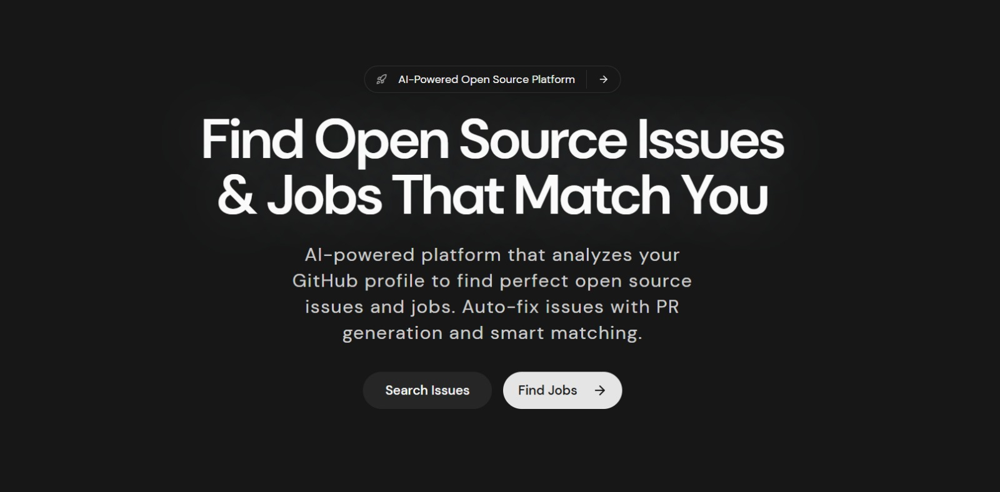

<p align="center">
  
</p>

<h1 align="center">Openso</h1>

<p align="center">
  <strong>Your Open-Source Career on Autopilot</strong>
</p>

<p align="center">
  AI-powered platform for developers to discover open-source issues, build personalized portfolios, land jobs, and chat with any GitHub repository — all in one place.
</p>

<p align="center">
  <a href="https://openso.dev"></a>
  <a href="https://x.com/zerolatency_"></a>
  <a href="https://github.com/vineeth-agi"></a>
  <a href="./LICENSE"></a>
</p>

<br/>

<p align="center">
  
</p>

---

## ✨ Features

### 🔍 Open Source Issue Finder
Stop scrolling through "good first issue" labels for hours. Openso indexes active OSS repos, classifies issues by difficulty, type, and availability, then ranks them using **semantic vector search** (pgvector) combined with structured filters — so you always find issues where you can make a real impact.

### 🧑‍💻 AI-Generated Portfolios with Recruiter Chatbot
Connect your GitHub once. Openso analyzes your commits, PRs, and projects, then generates a premium portfolio site. Each portfolio includes a **built-in AI chatbot** that answers recruiter questions using your real contribution data — no generic templates.

### 💬 Chat with Any Repository
Ask complex technical questions about any indexed repository in natural language. Openso clones, chunks, and indexes codebases so you can ask things like *"Where is auth handled?"* or *"Explain the workflow runner"* and get grounded, file-level answers.

### 🧠 Persistent Memory Brain
A stateful memory layer inspired by cognitive science — featuring episodic, semantic, procedural, and emotional memory types. Every conversation builds on the context of the last. Includes dream cycles for memory consolidation, knowledge graphs, and memory reconsolidation.

### 💼 Smart Job Search
Access curated job listings tracked across top tech companies, filtered by your stack. Apply directly from your developer dashboard with the context Openso already knows about you.

### 🤖 Telegram Bot Integration
Full-featured Telegram bot with the same capabilities as the web chat — including memory, tool use, rate limiting, and streaming responses. Connect your account and chat with your AI assistant on the go.

### 🔧 MCP Tool System
Extensible tool system supporting the **Model Context Protocol (MCP)**. Connect external MCP servers to extend your AI assistant's capabilities with custom tools — from GitHub operations to scheduling.

---

## 🛠️ Tech Stack

| Layer | Technology |
| :--- | :--- |
| **Framework** | [Next.js 15](https://nextjs.org/) (App Router) + [React 19](https://react.dev/) |
| **Language** | [TypeScript](https://www.typescriptlang.org/) (strict mode) |
| **Styling** | [Tailwind CSS 4](https://tailwindcss.com/) + [shadcn/ui](https://ui.shadcn.com/) |
| **Database & Auth** | [InsForge](https://insforge.dev/) (Postgres, Auth, Row-Level Security, Storage) |
| **AI Models** | [xAI](https://x.ai/) (Grok 4.20) via [Vercel AI SDK](https://sdk.vercel.ai/) |
| **Embeddings** | [Voyage AI](https://www.voyageai.com/) (768d vectors + pgvector) |
| **Caching & Rate Limiting** | [Upstash Redis](https://upstash.com/) |
| **Background Jobs** | [Upstash Workflow](https://upstash.com/docs/qstash/workflow/gettingstarted) + [QStash](https://upstash.com/docs/qstash/whatisqstash) |
| **Sandboxed Execution** | [Daytona SDK](https://www.daytona.io/) |
| **GitHub Integration** | [Octokit](https://github.com/octokit/rest.js) + GitHub App |
| **Testing** | [Vitest](https://vitest.dev/) + [fast-check](https://fast-check.dev/) (property-based) |

---

## 🏗️ Architecture

```
┌────────────────────────────────────────────────────────────────┐
│                        Next.js 15 App Router                   │
├──────────────┬──────────────┬──────────────┬──────────────────-┤
│   Dashboard  │  Portfolio   │   Chat UI    │   Telegram Bot    │
│   (authed)   │  (public)    │  (authed)    │   (webhook)       │
├──────────────┴──────────────┴──────────────┴──────────────────-┤
│                         API Routes                             │
│  /api/chat  /api/portfolio-chat  /api/telegram/webhook  ...    │
├────────────────────────────────────────────────────────────────┤
│                      Core Libraries                            │
│  ┌─────────┐ ┌──────────┐ ┌────────────┐ ┌────────────────┐   │
│  │ AI/LLM  │ │  Memory  │ │  MCP Tools │ │  GitHub Memory │   │
│  │ Router  │ │  System  │ │  System    │ │  Ingestion     │   │
│  └─────────┘ └──────────┘ └────────────┘ └────────────────┘   │
├────────────────────────────────────────────────────────────────┤
│  InsForge (Postgres + Auth + Storage)  │  Upstash (Redis + QStash) │
└────────────────────────────────────────────────────────────────┘
```

---

## 🚀 Getting Started

### Prerequisites

- [Node.js](https://nodejs.org/) v20+
- npm (included with Node.js)

### Installation

1. **Clone the repository:**
   ```bash
   git clone https://github.com/vineeth-agi/openso.git
   cd openso
   ```

2. **Install dependencies:**
   ```bash
   npm install
   ```

3. **Configure environment variables:**
   ```bash
   cp .env.example .env.local
   ```
   Fill out your credentials in `.env.local`. See [`.env.example`](./.env.example) for documentation on each variable.

4. **Run the development server:**
   ```bash
   npm run dev
   ```
   Open [http://localhost:3000](http://localhost:3000) to view your local deployment.

---

## ⚙️ Scripts

| Command | Description |
| :--- | :--- |
| `npm run dev` | Start Next.js development server |
| `npm run dev:turbo` | Start with Turbopack (faster HMR) |
| `npm run build` | Production-optimized build |
| `npm run lint` | Lint codebase with auto-fixes |
| `npm run format` | Run Prettier across the project |
| `npm test` | Run unit/integration tests with Vitest |
| `npm run test:watch` | Run tests in watch mode |

---

## 📦 Project Structure

```
openso/
├── src/
│   ├── app/                    # Next.js App Router
│   │   ├── (site)/             # Public pages (landing, auth, legal)
│   │   ├── (dashboard)/        # Authenticated dashboard routes
│   │   └── api/                # API routes (chat, cron, webhooks, etc.)
│   ├── components/             # Shared UI components
│   ├── views/                  # Page-level views (Chat, Jobs, Memory)
│   ├── lib/
│   │   ├── ai/                 # AI model router, provider config, telemetry
│   │   ├── memory/             # Memory system (episodic, semantic, procedural)
│   │   ├── mcp/                # Model Context Protocol client & servers
│   │   ├── github-memory/      # GitHub repo indexing & retrieval
│   │   ├── portfolio-chat/     # Portfolio chatbot logic
│   │   ├── tools/              # Native tool implementations
│   │   ├── security/           # Token encryption, rate limiting, auth
│   │   ├── insforge/           # InsForge SDK wrappers
│   │   └── workflow/           # Background job definitions
│   └── portfolio-src/          # Portfolio site UI & templates
├── docs/                       # Architecture docs & design specs
├── public/                     # Static assets
└── .env.example                # Environment variable reference
```

---

## 🤝 Contributing

We welcome contributions! Please see [CONTRIBUTING.md](./CONTRIBUTING.md) for guidelines on:

- Setting up the development environment
- Submitting pull requests
- Reporting bugs
- Code style and conventions

---

## 🔒 Security

For security concerns, please see our [Security Policy](./docs/SECURITY.md). To report a vulnerability, email [security@openso.dev](mailto:security@openso.dev) — **do not** open a public issue.

---

## 📄 License

Licensed under the [MIT License with Commons Clause](./LICENSE).

You may use, modify, and distribute this software freely — including for commercial purposes — provided you do not resell Openso itself in its original or substantially unmodified form.

---

## 👨‍💻 Author

Built by **[Vineeth Kumar](https://github.com/vineeth-agi)** — full-stack developer

<p align="center">
  <sub>If Openso helps you land your next contribution or job, consider giving it a ⭐</sub>
</p>
