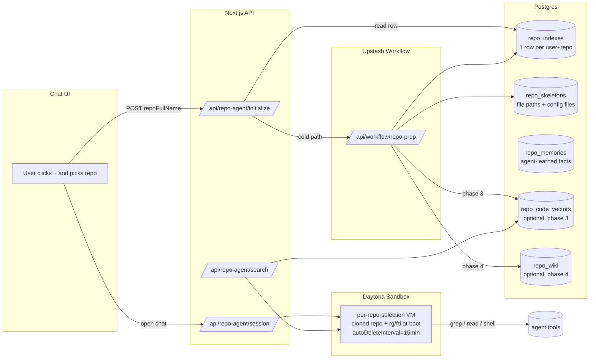

# Repo Indexing Rebuild — Part 1: Storage & Control Flow

> Companion docs:
> - `docs/repo-indexing-rebuild-research.md` — verified findings from
>   the local clone-and-read pass on Shadow + OpenHands.
> - `docs/repo-indexing-rebuild-plan-2-tools-and-phasing.md` — the
>   tool surface for the chat agent and the phased rollout.

This file covers what we store, where we store it, and how data
moves when a user picks a repo or pushes code.

## 0. Goals

1. Picking a repo from the chat "+" menu feels instant (< 1 s round
   trip in the warm path, < 5 s in the cold path).
2. The agent can answer questions about any repo the user owns,
   including monorepos. No hard cap on what's reachable to grep /
   read; only the JSON tree dump returned in a single tool call is
   capped (~10 k entries, then a truncation flag).
3. Background prep work is durable, idempotent, and not chained
   into GitHub Memory Ingest / Sync.
4. Code execution (running tests, applying patches, opening PRs)
   happens inside a Daytona sandbox that the chat session owns.
5. We never re-introduce the failure mode where three different
   workflows all kick off the same indexer.

## 1. Architecture in one diagram



## 2. Storage model

Three required tables, two optional. All under RLS keyed on
`user_id`. Names changed from the deleted ones (`repo_code_chunks`,
`repo_index_status`) to make sure we never confuse them.

### 2.1 `repo_indexes` (required) — per-repo state row

Equivalent to Shadow's `RepositoryIndex` but with explicit status,
stale flag, language stats, and AGENTS.md slot.

```sql
CREATE TABLE repo_indexes (
  id              UUID PRIMARY KEY DEFAULT gen_random_uuid(),
  user_id         UUID NOT NULL REFERENCES auth.users(id) ON DELETE CASCADE,
  repo_full_name  TEXT NOT NULL,
  status          TEXT NOT NULL DEFAULT 'pending'
                    CHECK (status IN ('pending','preparing','ready','failed')),
  is_stale        BOOLEAN NOT NULL DEFAULT false,
  stale_reason    TEXT CHECK (stale_reason IN ('push','timeout','manual') OR stale_reason IS NULL),
  cancel_requested BOOLEAN NOT NULL DEFAULT false,
  head_commit_sha TEXT,
  default_branch  TEXT,
  prep_started_at TIMESTAMPTZ,
  prep_finished_at TIMESTAMPTZ,
  total_files     INT,
  indexed_files   INT,
  total_bytes     BIGINT,
  language_stats  JSONB,           -- { "ts": 412, "tsx": 88, "json": 5, ... }
  agents_md       TEXT,            -- contents of AGENTS.md or .openhands/microagents/repo.md if present (cap 32 KB)
  semantic_index  TEXT NOT NULL DEFAULT 'none'
                    CHECK (semantic_index IN ('none','partial','ready')),
  error_message   TEXT,
  created_at      TIMESTAMPTZ NOT NULL DEFAULT now(),
  updated_at      TIMESTAMPTZ NOT NULL DEFAULT now(),
  UNIQUE (user_id, repo_full_name)
);

CREATE INDEX repo_indexes_user_idx        ON repo_indexes (user_id);
CREATE INDEX repo_indexes_stale_idx       ON repo_indexes (is_stale, updated_at) WHERE is_stale;
CREATE INDEX repo_indexes_preparing_idx   ON repo_indexes (status, prep_started_at) WHERE status = 'preparing';
```

Why split `status` from `is_stale` instead of using a single enum
(unlike the deleted schema): if HEAD changes while the row is
`ready`, we don't want to lose the previous SHA. The previous
sandbox keeps working against `head_commit_sha` while the next
selection re-preps for the new SHA.

### 2.2 `repo_skeletons` (required) — fast-fetch repo summary

Powers `get_repo_overview`. Path list as TEXT (compact), config
files as JSONB (small).

```sql
CREATE TABLE repo_skeletons (
  repo_index_id   UUID PRIMARY KEY REFERENCES repo_indexes(id) ON DELETE CASCADE,
  user_id         UUID NOT NULL,
  -- newline-delimited relative paths. 50k files ≈ ~3MB of text.
  -- TEXT compresses well; JSONB does not.
  file_paths      TEXT NOT NULL,
  -- compact metadata only the agent overview needs:
  config_files    JSONB NOT NULL,  -- { "package.json": "...", "tsconfig.json": "...", "Dockerfile": "..." }
  truncated_paths BOOLEAN NOT NULL DEFAULT false,
  total_files     INT NOT NULL,
  built_at        TIMESTAMPTZ NOT NULL DEFAULT now()
);

CREATE INDEX repo_skeletons_user_idx ON repo_skeletons (user_id);
```

`config_files` always includes (when present): `package.json`,
`tsconfig.json`, `pyproject.toml`, `requirements.txt`, `go.mod`,
`Cargo.toml`, `Dockerfile`, `docker-compose.yml`, `Makefile`,
`README.md`, `.env.example`, `prisma/schema.prisma`. Each capped at
8 KB. Same critical-file list Shadow's `core.ts` uses.

### 2.3 `repo_memories` (required) — agent-learned facts

Direct port of Shadow's `Memory` model. Same 10 categories.

```sql
CREATE TYPE repo_memory_category AS ENUM (
  'INFRA','SETUP','STYLES','ARCHITECTURE','TESTING',
  'PATTERNS','BUGS','PERFORMANCE','CONFIG','GENERAL'
);

CREATE TABLE repo_memories (
  id            UUID PRIMARY KEY DEFAULT gen_random_uuid(),
  user_id       UUID NOT NULL,
  repo_index_id UUID NOT NULL REFERENCES repo_indexes(id) ON DELETE CASCADE,
  category      repo_memory_category NOT NULL,
  content       TEXT NOT NULL CHECK (char_length(content) <= 4096),
  source_paths  TEXT[],
  created_at    TIMESTAMPTZ NOT NULL DEFAULT now(),
  pinned        BOOLEAN NOT NULL DEFAULT false
);

CREATE INDEX repo_memories_user_repo_idx ON repo_memories (user_id, repo_index_id, created_at DESC);
CREATE INDEX repo_memories_category_idx  ON repo_memories (category);
```

### 2.4 `repo_code_vectors` (Phase 3, optional) — semantic chunks

Only added when we move past grep-only. Pin pgvector ≥ 0.8 so the
search RPC can use iterative scans.

```sql
CREATE EXTENSION IF NOT EXISTS vector; -- requires >= 0.8

CREATE TABLE repo_code_vectors (
  id            UUID PRIMARY KEY DEFAULT gen_random_uuid(),
  user_id       UUID NOT NULL,
  repo_index_id UUID NOT NULL REFERENCES repo_indexes(id) ON DELETE CASCADE,
  file_path     TEXT NOT NULL,
  chunk_index   INT NOT NULL,
  start_line    INT NOT NULL,
  end_line      INT NOT NULL,
  symbol_name   TEXT,                      -- e.g. "indexRepo", null for sliding-window chunks
  symbol_kind   TEXT,                      -- 'function','class','method', null otherwise
  lang          TEXT,                      -- 'ts','py','tsx',...
  content       TEXT NOT NULL,             -- truncated to 8 KB on insert
  embedding     vector(1024) NOT NULL,
  commit_sha    TEXT NOT NULL,
  UNIQUE (repo_index_id, file_path, chunk_index)
);

CREATE INDEX repo_code_vectors_hnsw
  ON repo_code_vectors USING hnsw (embedding vector_cosine_ops);
CREATE INDEX repo_code_vectors_repo_idx
  ON repo_code_vectors (repo_index_id, file_path);
```

200-line max per chunk. Same as Shadow's
`DEFAULT_MAX_LINES_PER_CHUNK = 200`.

### 2.5 `repo_wiki` (Phase 4, optional) — generated narrative

Direct port of Shadow's `CodebaseUnderstanding`.

```sql
CREATE TABLE repo_wiki (
  repo_index_id UUID PRIMARY KEY REFERENCES repo_indexes(id) ON DELETE CASCADE,
  user_id       UUID NOT NULL,
  content       JSONB NOT NULL,            -- { rootSummary, perDir: { ... }, perFile: { ... } }
  generated_at  TIMESTAMPTZ NOT NULL DEFAULT now(),
  generator_model TEXT,                    -- which mini model produced it
  total_tokens  INT
);
```

### 2.6 RLS

```sql
ALTER TABLE repo_indexes      ENABLE ROW LEVEL SECURITY;
ALTER TABLE repo_skeletons    ENABLE ROW LEVEL SECURITY;
ALTER TABLE repo_memories     ENABLE ROW LEVEL SECURITY;
ALTER TABLE repo_code_vectors ENABLE ROW LEVEL SECURITY;
ALTER TABLE repo_wiki         ENABLE ROW LEVEL SECURITY;

-- USING (auth.uid() = user_id) on each.
-- Service role bypass for the workflow / API.
```

## 3. Component layout

```
src/lib/repo-prep/                 -- new module, replaces deleted repo-indexer
  index.ts                         -- prepRepo({userId, repoFullName})
  cloner.ts                        -- tarball download (small repos) or git clone in sandbox (large)
  walker.ts                        -- file walk + exclusion + tier classify
  skeleton.ts                      -- file_paths + config_files JSON
  agents-md.ts                     -- detect AGENTS.md / .openhands/microagents/repo.md
  storage.ts                       -- repo_indexes / repo_skeletons CRUD
  vectors.ts                       -- (phase 3) chunk + embed + write repo_code_vectors
  wiki.ts                          -- (phase 4) generate repo_wiki via mini model

src/lib/repo-agent/                -- existing, refactored
  tools.ts                         -- new tool surface (see Part 2)
  session.ts                       -- per-chat sandbox lifecycle
  memory.ts                        -- repo_memories CRUD
  delete indexer-script.ts         -- legacy disk-vector-store builder

src/app/api/repo-agent/
  initialize/route.ts              -- replace; status check + cold-trigger only
  search/route.ts                  -- new; pgvector search (phase 3)
  session/route.ts                 -- new; create or attach a sandbox for the chat
  delete/route.ts                  -- existing, keep

src/app/api/workflow/
  repo-prep/route.ts               -- new Upstash Workflow; replaces deleted repo-index-incremental

supabase/migrations/
  20260601_repo_prep_phase1.sql    -- Phase 1 tables + indexes + RLS
  20260601_repo_prep_phase3.sql    -- Phase 3 (gated, applied later)
  20260601_repo_prep_phase4.sql    -- Phase 4 (gated, applied later)
```

## 4. The two control paths

### 4.1 Cold path — first time the user picks a repo

1. UI POSTs to `/api/repo-agent/initialize` with `repoFullName`.
2. API runs **one** SQL statement, atomic upsert + decision:

```sql
INSERT INTO repo_indexes (user_id, repo_full_name, status, prep_started_at)
VALUES ($1, $2, 'preparing', now())
ON CONFLICT (user_id, repo_full_name) DO UPDATE
SET
  status = CASE
    -- already done and not stale: keep
    WHEN repo_indexes.status = 'ready' AND NOT repo_indexes.is_stale
      THEN repo_indexes.status
    -- another tab started prep recently: keep, just poll
    WHEN repo_indexes.status = 'preparing'
     AND repo_indexes.prep_started_at > now() - interval '5 minutes'
      THEN repo_indexes.status
    -- stuck or stale: restart
    ELSE 'preparing'
  END,
  prep_started_at = CASE
    WHEN repo_indexes.status = 'ready' AND NOT repo_indexes.is_stale
      THEN repo_indexes.prep_started_at
    WHEN repo_indexes.status = 'preparing'
     AND repo_indexes.prep_started_at > now() - interval '5 minutes'
      THEN repo_indexes.prep_started_at
    ELSE now()
  END,
  cancel_requested = false,
  updated_at = now()
RETURNING
  id, status, is_stale, head_commit_sha, total_files, semantic_index,
  (xmax = 0) AS just_inserted;
```

3. If `status = 'ready'` AND NOT `is_stale` → return immediately
   (warm path, see § 4.2).
4. Otherwise the API triggers the workflow **only when this query
   actually flipped the row to `preparing`** (either inserted or
   updated). Avoids the race where two tabs both start prep:

```ts
if (row.status === 'preparing' && (row.just_inserted || rowWasUpdatedHere)) {
  await workflowClient.trigger({
    url: workflowUrl('repo-prep'),
    body: { userId, repoFullName, repoIndexId: row.id },
  });
}
return NextResponse.json({
  status: 'preparing', repoFullName, etaSeconds: 60,
});
```

5. The UI keeps polling `/api/repo-agent/initialize`; the same
   atomic SQL is harmless on re-call (it never downgrades a `ready`
   row, never restarts a fresh `preparing` row).

6. Workflow `/api/workflow/repo-prep` runs durable steps:
   - Step 1 `cancel-check` — if `cancel_requested`, return early.
   - Step 2 `clone` — if `repository.size_kb < 500_000`, download
     tarball into the function. Else create / attach a Daytona
     sandbox and `git clone --depth=1 --filter=blob:none` inside it.
   - Step 3 `walk-and-classify` — walk files, apply exclusion list,
     produce path list + tier classification + language_stats.
   - Step 4 `build-skeleton` — write `repo_skeletons.file_paths`
     and `repo_skeletons.config_files`.
   - Step 5 `detect-agents-md` — read AGENTS.md or
     `.openhands/microagents/repo.md` if present, write to
     `repo_indexes.agents_md`.
   - Step 6 (Phase 3 only) `embed-chunks` — tree-sitter symbol walk,
     chunk via Shadow's chunker logic (rewritten by us), batch
     through Voyage `voyage-code-3`, write `repo_code_vectors`,
     set `semantic_index = 'ready'`.
   - Step 7 (Phase 4 only) `generate-wiki` — mini-model summary
     pass, write `repo_wiki`.
   - Step 8 `finalize` — set `status='ready'`, `is_stale=false`,
     `head_commit_sha=$current`, `prep_finished_at=now()`,
     `total_files`, `indexed_files`.

   Every step starts with a 1-line `cancel-check`. If the user
   deselects mid-prep, `repo_indexes.cancel_requested = true` short
   -circuits the chain.

### 4.2 Warm path — repo already prepped

1. UI POSTs `/api/repo-agent/initialize`. Atomic upsert sees
   `status = 'ready'` and not stale. Returns immediately:

```json
{
  "status": "ready",
  "repoFullName": "owner/repo",
  "totalFiles": 4123,
  "headCommitSha": "abc1234...",
  "semanticIndex": "ready"
}
```

2. UI flips the chip to "Indexed".
3. When the user sends the first chat message for this selection,
   the chat handler calls `/api/repo-agent/session`:
   - Creates a Daytona sandbox if none is attached to this
     (browser tab × repo selection) pair.
   - Inside `create_sandbox` the boot script now also runs:
     `apt-get install -y -qq ripgrep fd-find`. If install fails,
     tools fall back to grep / find.
   - Clones the repo at `head_commit_sha` via the existing
     `git clone` setup (the `connected_apps.access_token` injected
     as `GITHUB_TOKEN`).
   - Returns `sandboxId` to the chat.
4. Sandbox lifetime stays as today: per repo selection per browser
   tab, auto-cleanup on switch / deselect, Daytona
   `autoDeleteInterval=15` as the safety net.

### 4.3 Stale path — push happened

> **Prerequisite**: this path is dead until we land
> `connected_apps.installation_id` (or a sibling
> `github_app_installations` table). The current webhook query at
> `webhooks/github/route.ts:89` already returns null for every
> push because the column doesn't exist. Until then, the system
> relies on the user re-picking the repo to trigger a refresh —
> which works fine, just not automatic.

1. Webhook receives `push`. Resolves installation → user_id from
   the new `installation_id` column.
2. Updates the matching row: `is_stale = true`,
   `stale_reason = 'push'`. Keeps the previous `head_commit_sha`
   intact so any active sandbox keeps working.
3. Next time the user picks this repo, `/api/repo-agent/initialize`
   sees `is_stale = true` and the atomic upsert flips it to
   `preparing` + triggers the workflow.

This matches Shadow's posture: their webhook handler also doesn't
re-index on push — re-prep is implicit on next task creation.

## 5. Indexing semantics (what counts as "skip noise")

Default exclusion list used by `walker.ts`. Same shape Shadow
uses, with our additions for monorepos and lockfiles.

### 5.1 Directory names (skip)

`node_modules`, `.git`, `dist`, `build`, `out`, `.next`, `.nuxt`,
`.cache`, `target`, `vendor`, `__pycache__`, `.venv`, `venv`,
`env`, `coverage`, `.idea`, `.vscode/.history`, `.gradle`,
`.terraform`, `bower_components`, `.shadow`, `.deepsec`,
`.tmp-research`.

### 5.2 File extensions (skip — binary / generated)

`.png .jpg .jpeg .gif .webp .ico .pdf .zip .tar .gz .tgz .7z .rar
.mp3 .mp4 .mov .wav .ogg .ttf .woff .woff2 .eot .so .dylib .dll
.exe .bin .wasm .lock`.

### 5.3 Lockfiles (skip)

`package-lock.json`, `pnpm-lock.yaml`, `yarn.lock`, `Cargo.lock`,
`Gemfile.lock`, `poetry.lock`, `go.sum`, `composer.lock`.

### 5.4 Generated patterns (skip)

`**/*.min.js`, `**/*.bundle.js`, `**/*.generated.{ts,js}`,
`**/*.d.ts` (skip for indexing, NOT for grep at chat time).

### 5.5 Tier classification (for Phase 3 ordering only)

- **P0** — root configs: `package.json`, `tsconfig.json`,
  `pyproject.toml`, `go.mod`, `Cargo.toml`, `Dockerfile`,
  `Makefile`, `README.md`, `AGENTS.md`,
  `.openhands/microagents/repo.md`.
- **P1** — top-level source dirs: `src/**`, `app/**`, `lib/**`,
  `pkg/**`.
- **P2** — components / modules below P1.
- **P3** — tests, fixtures, examples.

Tiering only affects embedding **order** (P0 first so semantic
search becomes useful as soon as P0 is embedded). Every tier is
fully indexed; no budget cap.

### 5.6 Hard caps (graceful degradation, not refusal)

- Single-file size for indexing: 1 MB. Bigger files get a stub
  entry in `repo_skeletons` but no chunk in `repo_code_vectors`.
  Grep still sees them at chat time.
- Per-repo file count for tree-sitter parse: 200k files. Above that
  we still build the skeleton + grep path; semantic_search becomes
  a stretch goal for that repo.
- Tarball size for in-function path: 500 MB. Above that the cold
  path goes through Daytona regardless.

Skeleton's `file_paths` cap on the JSON returned to the agent in
one tool call: 10k entries, then a `truncated_paths = true` flag.
The actual table holds the full list.
